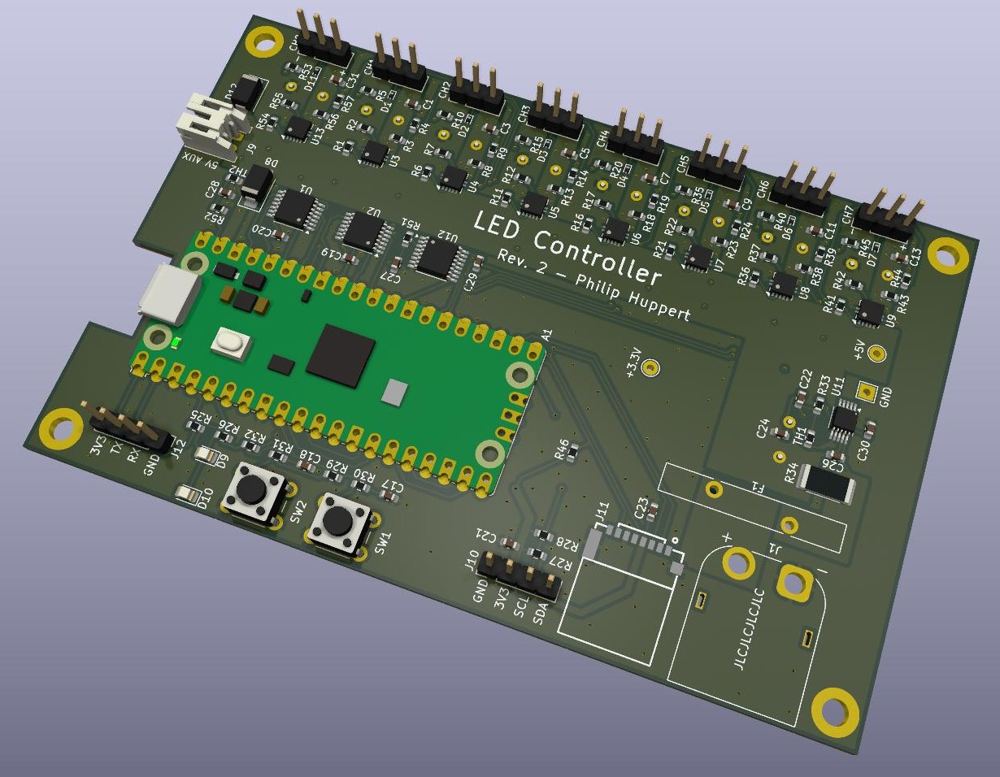

# 8-Channel WS2812 Controller

High-performance WS2812 LED controller based on the Raspberry Pi Pico, designed for driving large LED installations with up to 8 independent channels.

## Features

- **8 independent WS2812 channels** - Drive up to 200 LEDs per channel @ 60Hz
- **Multiple operation modes:**
  - USB streaming mode (real-time control from computer)
  - Standalone mode (run animations directly on Pico)
  - SD card playback mode (hardware ready, firmware not yet implemented)
- **Built-in test patterns** for calibration and diagnostics
- **Comprehensive monitoring** - voltage, current, and temperature sensing
- **Advanced protection** - smart fuses, PTC, and TVS diodes

## Hardware Specifications

### PCB Design
- **4-layer PCB**
- **Raspberry Pi Pico** microcontroller (direct solder or via header)
- Compact form factor

### LED Output Channels
- **8 independent channels** driven via PIO state machines
- **3.3V to 5V level shifters** for reliable WS2812 communication
- **Smart fuse protection** (TPS259251) set to 3.7A per channel
- **TVS diodes** on all data lines for protection

### Power System
- **5V input** via XT60 connector
- **Input PTC** for overcurrent protection
- **5V auxiliary output** for powering additional devices (fans, Raspberry Pi, etc.)
- **INA226 current/voltage monitor** for real-time power consumption tracking

### Sensing and Monitoring
- **Input power monitoring** via INA226 (voltage and current)
- **2× NTC temperature sensors** for thermal monitoring
- **Per-channel voltage sensing** via 8:1 analog multiplexer
- **Trip detection** - automatic fault detection when channels go offline

### User Interface
- **2 buttons** for pattern selection and reset
- **2 status LEDs** (activity and fault indicators)
- **I2C OLED display header** for local status display (optional)

### Storage
- **SD card slot** for storing animations and configuration files
- **Note:** SD card support is not currently implemented in the firmware, but it was verified that the slot is correctly wired and the Pico can access data on an SD card

## Implementation & Assembly Notes

### Capacitors
- The layout contains space for through-hole capacitors on the input rail and on each output rail
- These were not fitted on the controller that ran the installation and can be considered optional

### Channel Output Connectors
- The pin headers on the channel outputs do fit into JST-SM plugs commonly used with LED strings
- However, the spacing of the pin headers is too tight for two JST-SM plugs next to each other
- There is no mechanical interlocking, and if you pass any decent current (over 1A) these connections will get quite warm, especially if not well inserted
- **Recommendation:** For the controller used in the installation, we soldered pigtails with JST-SM sockets directly to the controller PCB for more reliable connections

### Pico Mounting
- The Pi Pico was mounted with a socket to allow easier exchange in case of failure
- This is recommended over direct soldering for serviceability

## Firmware

See `../pico_firmware/` for the Raspberry Pi Pico firmware source code.

## License

Hardware design licensed under **CERN-OHL-W** (CERN Open Hardware License - Weakly Reciprocal)
